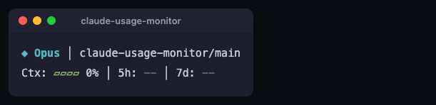
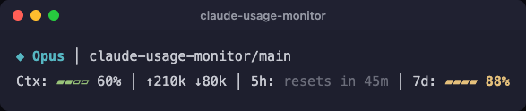
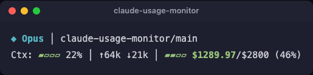
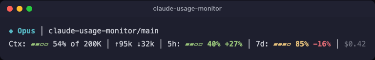
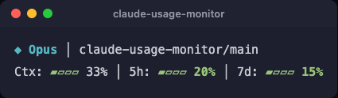
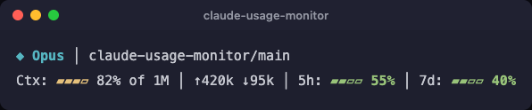
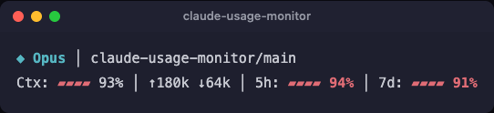

<h1 align="center">claude-usage-monitor</h1>

<p align="center">
  <a href="https://github.com/koosolek/claude-usage-monitor/stargazers"></a>
  <a href="https://github.com/koosolek/claude-usage-monitor/actions/workflows/smoke-tests.yml"></a>
  <a href="LICENSE"></a>
</p>

<p align="center">
  Claude Code statusline plugin that shows your quota usage, context, and tokens directly in the terminal.
  <br>
  No API keys. No telemetry. No dependencies. Runs locally.
</p>

<p align="center">
  <sub>A personal fork of <a href="https://github.com/aiedwardyi/claude-usage-monitor">aiedwardyi/claude-usage-monitor</a>, customized for running the same statusline consistently across multiple Claude plans (Pro, Team, Enterprise) - see <a href="#enterprise-plans">Enterprise plans</a> below. Defaults and behavior have diverged from upstream; if you want the original project, use the link above.</sub>
</p>

<p align="center">
  
  <br>
  <sub>Real-time usage tracking - green to yellow to red as your session progresses, then a reset countdown once a quota is fully used.</sub>
</p>

## Quickstart

### Windows PowerShell

```powershell
irm https://raw.githubusercontent.com/koosolek/claude-usage-monitor/v0.1.3/install.ps1 | iex
```

### macOS / Linux

```bash
curl -fsSL https://raw.githubusercontent.com/koosolek/claude-usage-monitor/v0.1.3/install.sh | bash
```

### What you get

After install, restart Claude Code. Your statusline now shows:

```text
◆ Opus │ my-project/main
Ctx: ▰▱▱▱ 25% │ ↑50k ↓12k │ 5h: ▰▰▰▱ 80% │ 7d: ▰▱▱▱ 34%
```

- **5h / 7d quota** - see how much you've used before you hit limits
- **Context %** - see when you're running low before Claude tells you
- **Token counts** - input and output for the current session
- **Reset countdown** - once a quota hits 100%, its bar is replaced with a "resets in" countdown

Uses your existing Claude Code OAuth session. No extra API key or Python packages needed. Windows launches Python directly - no Git Bash requirement.

### Prefer to audit first

```bash
git clone https://github.com/koosolek/claude-usage-monitor.git
cd claude-usage-monitor
git switch --detach v0.1.3
python install.py
```

On Windows, `py -3 install.py` works too.

The installer:

- copies launcher files into `~/.claude/plugins/claude-usage-monitor`
- updates `~/.claude/settings.json` (backs up to `settings.json.bak` first)
- runs a launcher smoke check and prints the verify command

### Verify manually

If you want to verify the launcher yourself before restarting Claude Code:

- Windows: `type nul | "C:\Users\you\.claude\plugins\claude-usage-monitor\statusline.cmd"`
- macOS / Linux: `printf '' | bash ~/.claude/plugins/claude-usage-monitor/statusline.sh`

## What it shows

| Segment | Description |
|---|---|
| `◆ Opus` | Active model |
| `my-project/main` | Project name and git branch |
| `Ctx: ▰▱▱▱ 25%` | Context window used |
| `↑50k ↓12k` | Input and output tokens |
| `5h: ▰▰▰▱ 80%` | 5-hour quota used, with bar |
| `7d: ▰▱▱▱ 34%` | 7-day quota used, with bar |

All bars show used % by default - they start empty (green) and fill toward full (red) as you use more. Set `CQB_REMAINING=1` for a draining remaining-% fuel gauge instead.

### Color coding

| Color | Meaning |
|---|---|
| Green | Under 70% used |
| Yellow | 70-90% used |
| Red | Over 90% used |

### Once a quota is fully used

The bar and percentage for that quota are replaced by a `resets in <time>` countdown, since a maxed-out bar has nothing useful left to show:



## Enterprise plans

Anthropic's usage API returns `null` 5h/7d rate limits for Enterprise plans - they're billed against a monthly spend limit instead. This is detected automatically and swaps the second line for a spend display:



No configuration needed - if your plan reports a spend limit instead of 5h/7d utilization, the statusline shows it that way on its own.

## Trust and security

At runtime, the tool:

- reads Claude Code session JSON from `stdin`
- reads your OAuth token from the macOS Keychain (falling back to `~/.claude/.credentials.json`) for `claudeAiOauth.accessToken` (unless `CLAUDE_CODE_OAUTH_TOKEN` is set)
- runs `git rev-parse --abbrev-ref HEAD` for the branch name
- writes `claude-sl-usage.json` and `claude-sl-usage.lock` in your system temp directory
- makes one HTTPS request to `https://api.anthropic.com/api/oauth/usage`

It does **not** install dependencies, collect telemetry, or send any local data besides the usage API call.

The installer writes only to:

- `~/.claude/plugins/claude-usage-monitor/`
- `~/.claude/settings.json` (with `.bak` backup)

More detail in [SECURITY.md](SECURITY.md).

## Requirements

- [Claude Code CLI](https://docs.anthropic.com/en/docs/claude-code) with an active subscription
- Python 3.10+ (`python3`, `python`, or `py -3`)
- macOS / Linux: `bash`
- Windows: no Git Bash requirement

## How it works

1. Claude Code pipes session JSON into the launcher on every refresh.
2. `statusline.py` parses the payload and reads your Claude Code OAuth token.
3. It calls Anthropic's usage endpoint to fetch 5-hour and 7-day utilization.
4. Results are cached in your system temp directory for 5 minutes.
5. The script prints a two-line ANSI statusline.

The first render may show `5h: --` and `7d: --` until the background fetch completes.

## Compatibility

| Platform | Launcher | Status |
|---|---|---|
| Windows 11 | `statusline.cmd` | Tested |
| macOS | `statusline.sh` | Tested in CI |
| Linux | `statusline.sh` | Tested in CI |

## Customization

Every segment is toggleable via environment variables. Set them in your shell profile or in `~/.claude/settings.json`:

```json
{
  "env": {
    "CQB_PACE": "1",
    "CQB_CONTEXT_SIZE": "1",
    "CQB_COST": "1"
  }
}
```

| Variable | Default | Description |
|---|---|---|
| `CQB_TOKENS` | `1` | Show token counts |
| `CQB_BRANCH` | `1` | Show git branch |
| `CQB_CONTEXT_SIZE` | `0` | Show context size label such as `of 1M` |
| `CQB_PACE` | `0` | Show pacing indicator |
| `CQB_COST` | `0` | Show session cost |
| `CQB_REMAINING` | `0` | Show used % for quotas (fills as you use more); set `1` for a draining remaining-% fuel gauge |
| `CQB_BAR` | `1` | Show visual progress bar next to 5h/7d quotas |

There's no toggle for reset countdowns or session duration - a quota's bar automatically switches to a `resets in <time>` countdown once it hits 100% used, and session duration was dropped as noise on a glanceable statusline.

### Presets

**Maximal**



```json
{ "env": { "CQB_PACE": "1", "CQB_CONTEXT_SIZE": "1", "CQB_COST": "1" } }
```

**Minimal**



```json
{ "env": { "CQB_TOKENS": "0" } }
```

**Heavy context**



**Critical usage**



## Manual install

```bash
git clone https://github.com/koosolek/claude-usage-monitor.git
cd claude-usage-monitor
git switch --detach v0.1.3
python install.py
```

On Windows, `py -3 install.py` works too.

Or update `~/.claude/settings.json` yourself:

```json
{
  "statusLine": {
    "type": "command",
    "command": "bash /path/to/statusline.sh",
    "padding": 0
  }
}
```

On Windows, use the absolute path to `statusline.cmd` instead.

## Uninstall

1. Remove `~/.claude/plugins/claude-usage-monitor/`
2. Edit `~/.claude/settings.json` and remove the `statusLine` entry (restore `.bak` if needed)
3. Restart Claude Code

## Troubleshooting

**The launcher check fails**
Make sure `python3`, `python`, or `py -3` works from your shell.

**The statusline shows `5h: -- | 7d: --`**
The first API call runs in the background. Wait a few seconds and let Claude Code refresh.

**The statusline shows `5h: no token | 7d: no token`**
The usage API requires an OAuth login. If you logged in with an API key, run `claude login` to authenticate via browser instead. The OAuth token is read from the macOS Keychain, or `~/.claude/.credentials.json` on older Claude Code versions.

**Unicode characters look wrong**
Use a UTF-8 terminal font. On older Windows terminals, run `chcp 65001`.

**I want to inspect the network behavior**
Read [statusline.py](statusline.py) and [SECURITY.md](SECURITY.md). The only network call is to `https://api.anthropic.com/api/oauth/usage`.

## Contributing

Issues and pull requests are welcome. Start with [CONTRIBUTING.md](CONTRIBUTING.md).

If this is useful to you, a star helps others find it.

## License

MIT
